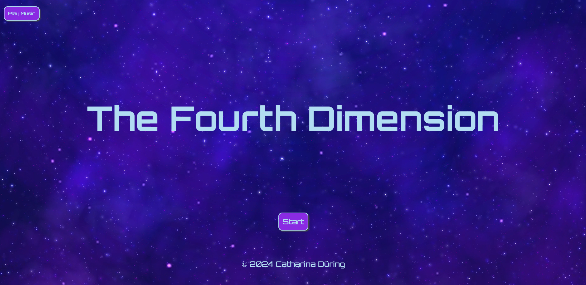

# The Fourth Dimension

## Innehåll:
* [Mål med uppgiften](#mål-med-uppgiften)
* [Förarbete](#förarbete)
* [Kommentarer/tankar/lärdomar](#kommentarer-tankar-lärdomar)
* [Källor, ljud, video, bilder mm](#källor-ljud-video-bilder-mm)
* [Övrigt](#övrigt)
* [Länk till demo](#länk-till-demo)

## Mål med uppgiften:
Uppgiften gick ut på att skapa en interaktiv upplevelse där användaren ska kunna göra förändringar i en värld. 

## Förarbete
Jag tog orden "låt kreativiten flöda" på fullt allvar. Väldigt omgående fick jag många ideer och började skriva ner en story för "spelet". För samlad story, v.g. se PDF-filen. Inspiration för min story har jag fått från Neverending story, The Labyrinth, Stargate, The Fifth Element, Alice i underlandet, musikalen Wicked och samt från musik av bla Futurecop!. Utöver detta bidrog mitt intresse för rymden och populärvetenskap till att det var givet för mig att storyn måste innehålla mycket inslag av detta. 

För att skapa en struktur för scen-innehållet och vilka scener som skulle leda vart, gjorde jag ett mycket enkelt (dock väldigt användbart) flödesschema med klassisk penna och papper. Detta är något jag kommer ta med mig som ett värdefullt hjälpmedel även in i framtida projekt. 

## Kommentarer/tankar/lärdomar:
* När det var dags att sätta igång och koda så började med att skapa funktioner för scenerna och få knapparna att ta mig dit jag ville. Nu i efterhand hade jag önskat att jag byggt upp mina funktioner på ett annat sätt så att de skulle varit mer dynamiska. Under tidens gång upplevde jag nämligen att jag blev lite låst vid strukturen över hur varje scen var tvungen att se ut och fungera. 
* Jag hade som målsättning att uppfylla samtliga VG-krav, men då jag fick problem att skapa local storage och samtidigt tidsbrist så blev jag tvungen att hoppa över denna punkten. Jag valde ändå att göra övriga VG-punkter för att ha gjort dessa moment och därmed ha fått öva på dem.  
* Bakgrundsmusik och ljudeffekter var kanske inte nödvändigt att lägga tid på, samtidigt så känns det väldigt kul att ha detta på plats för att förstärka upplevelsen och känslan i min värld. 
* Jag fick även ta ner målsättningen jag hade för vad man skulle kunna göra med mina för items då tiden sprang iväg. Jag fick "nöja" mig med att kunna plocka upp items i två scener och lägga ner dom i en annan och att detta visas visuellt samt med ljudeffekter. 
* Jag hade en vision att man i scen 3 skulle haft ett inputfält där svaret på gåtan skulle skrivas in och där rätt svar skulle göra högerknappen klickbar och därmed möjligt att komma vidare i spelet. Detta fick jag också hoppa över. 

## Källor ljud, video, bilder mm:
* Ljudeffekterna som spelas när man plockar upp och lägger ner items är hämtade från: https://pixabay.com/sound-effects/search/pling/
* Musiken som man kan välja att ha i bakgrunden är skapad av min bror Patrik Werner. 
* Gåtan i scen 3 The Rabbithole är hämtad från: https://riddlequests.com/riddles-about-time-with-answers/
* Bakgrundsvideon är hämtad från: https://www.pexels.com/video/a-sky-full-of-stars-at-night-2646392/
* Bilderna är hämtade från Google, förutom de tre item-bilderna som är genererade av ChatGPT. 

## Övrigt
* [Gå till PDF](https://github.com/cadring/JS-Assignment1/blob/main/docs/Individuell%20Inl%C3%A4mning%20Javascript%20The%20Fourth%20Dimension.pdf)

## Demo-länk:
* [Demolänk](https://cadring.github.io/JS-Assignment1/)

